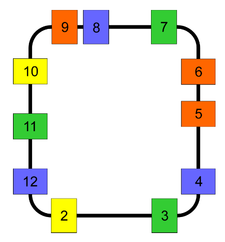

# Final Design Project - The Galbraith Memorial Mail Robot

The overall objective of this project is:

* To design a control system, based on Bayesian-localization techniques, for the Turtle-bot 3 Waffle Pi robot to deliver mail to arbitrarily chosen stations on a closed-loop route.

The robot is required to deliver mail on a closed-loop path to any one of several offices. This path can be considered in terms of the quadrilateral hallway on any floor of the Faculty of Applied Science and Engineering’s Galbraith Building, where office line the inner side of the loop. A topological map of the hallway is provided, which consists of a series of colored regions on the floor representing the locations of the offices connected by black tape to provide a guide for the robot. The offices (numbered 2 to 12, inclusive) are unique but the colors are not. As a result, it is essential to use Bayesian localization fused with the line-following control to facilitate the design.

## Software Setup
The following commands should be run in separate terminal windows sequentially to start the ROS program properly:
```$roscore``` [Remote PC]

```$roslaunch turtlebot3_bringup turtlebot3_robot.launch``` [TurtleBot]

```$roslaunch turtlebot3_bringup turtlebot3_rpicamera.launch``` [TurtleBot]

The robot’s camera is to be used as a color sensor both to distinguish the different color patches and to detect the path marked with tape. To run the node, SSH into the Turtlebot, and run:

```$rosrun turtlebot3_bringup camera.py``` [TurtleBot]

It will output two values, one being a line sensor (through the topic `/line_idx`), which outputs the index with the least light intensity in the camera image array (corresponding to the location of the black tape), and the other being an RGB value, indicating the mean pixel intensity in the current image (published via the topic `/mean_img_rgb`).

Lastly, run the script for the project by entering the following command in a terminal:

```$roslaunch sessionX final_project.py``` [Remote PC]

## Map
The map for the mail route will be as shown in Figure 1. A colored rectangular patch indicates the location of an office. The offices, of which there are 11, are uniquely numbered (from 2 to 12) but there are only four colors (blue, green, yellow, orange); the same color can therefore indicate different offices. The color patches are connected by black tape, which can be used to guide the robot on the route. Note, however, that the spacing of offices will not necessarily be uniform. 

<p align="center">
  
</p>
<p align="center">
  Figure 1. Sample Topological Map
</p>

## Requirements 
It is helpful to subdivide the controller design into various subsystems which are responsible for different tasks, in particular:
* Developing a system that processes the camera data to determine if the robot is at the doorway of an office (a color patch) or between offices along the hallway (the blacktape)
* Localizing the robot based on some model of the robot, sensor, and a map of the environment
* Navigating and moving to the desired offices

The robot is to mimic delivery of a parcel of mail by stopping at the desired office, rotating 90<sup>◦</sup>to the left, pausing and then rotating back to continue.
